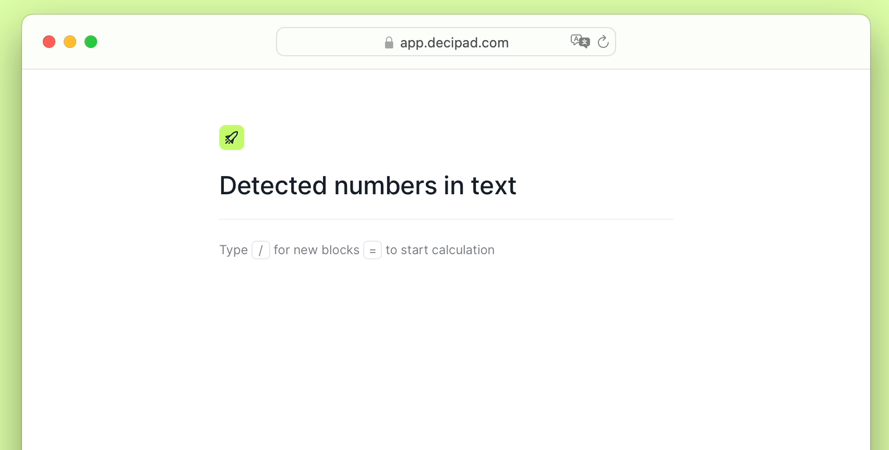

import {Stars, Hammer, FancyTitle} from '@site/src/components/FancyTitle';
import {ReleasePost} from '@site/src/components/ReleasePost';

<ReleasePost>

### <FancyTitle icon={Stars}>New Features</FancyTitle>

**Numbers are now automatically detected in text**, allowing you to easily turn them into calculations

**Updating your calculations just got easier and more flexible**   When you rename a variable, it will update everywhere it is used, meaning your calculations will no longer break. The only exception is renaming column names. We’re actively working on this!

**We’ve also added 3 new features to the bottom right of your notebook**:
* `Undo` and `Redo` buttons to revert any steps on your notebook.
* A `Status Indicator` that lets you know if your changes have been saved.
* A `Help Button` to contact the team, share feedback, and check our docs.

### <FancyTitle icon={Hammer}>Fixes and Improvements</FancyTitle>

- Calculation blocks and workspaces are more reader friendly on mobile.
- Make changes to published notebooks and republish when you finish.
- Place result widgets side-by-side.
- The autocomplete menu includes a tooltip to exit.
- Language tables support variable lengths.
- Updated designs for checkboxes on tables.
- Tangerine color added 🍊.
- More contrast on inline number colors.
- Result widgets display correct variable names.
- Result widget autocomplete display all available variables.

</ReleasePost>
