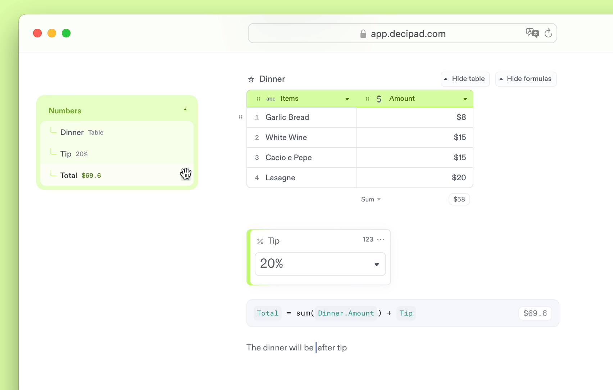

import {Stars, Hammer, FancyTitle} from '@site/src/components/FancyTitle';
import {ReleasePost} from '@site/src/components/ReleasePost';

<ReleasePost>

### <FancyTitle icon={Stars}>New Features</FancyTitle>

We’ve introduced a **catalog that showcases all numbers you’ve defined in your notebook**, making them accessible at a glance. This will help you:
  * See all numbers you have defined in one place
  * Quickly drag them from the catalog into your calculations or text
  * Navigate your notebook by sections

**We have a new dropdown widget** that lets you create lists of values anyone can pick from. This widget is great for calculations where you don’t want to input new values, but instead, pick from a list.

### <FancyTitle icon={Hammer}>Fixes and Improvements</FancyTitle>

- We’ve updated Decipad’s font to make numbers standout
- Formulas on tables can be hidden
- You now have the option to use `for` instead of `*` when making multiplications. For example, before `$400 per month * 1 year` now `$400 per month for 1 year`
- You can now control the number of rows with a variable on language tables
- We’ve added currency support for the Ukrainian hryvnia 🇺🇦. Example `400 UAH`
- When you create calculations with dates, these will keep your original units. (Calculations using days will have a result in days, for example)
- We fixed an issue where images on public notebooks could be deleted by users with read-only access.
- We fixed an issue where tables wouldn’t scroll all the way to the left.

</ReleasePost>
