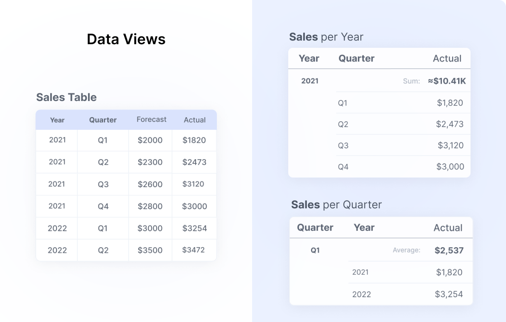
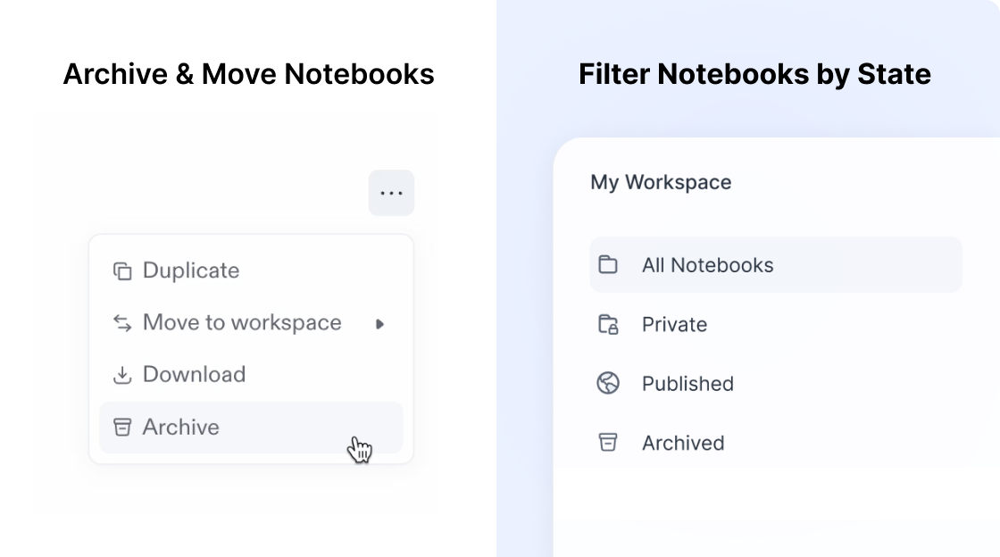

import {Stars, Hammer, FancyTitle} from '@site/src/components/FancyTitle';
import {ReleasePost} from '@site/src/components/ReleasePost';

<ReleasePost>

### <FancyTitle icon={Stars}>New Features</FancyTitle>

**Data Views** are a simple way to pivot your data!
  * Select the columns you want to showcase
  * Easily group your data by rows alike
  * Add quick calculations to highlight insights and drag into your notebook

**We've improved Workspaces**
  * Organize and move notebooks between workspaces
  * Easily find your published Notebooks
  * Archive or delete Notebooksㅤ

**Decipad Profiles**
* Update your profile picture with [Gravatar](https://en.gravatar.com/)
* Add a bio to your profile
* Pick an account username

**Transform Notebook Blocks**
* Turn blocks types into others', for instance, a paragraph into a heading
* Turn any widget into another
* Turn a calculation blocks into a widget

### <FancyTitle icon={Hammer}>Fixes and Improvements</FancyTitle>

* 

</ReleasePost>
