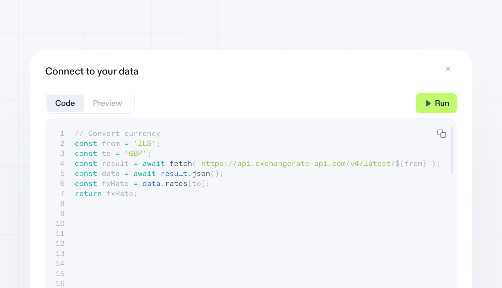
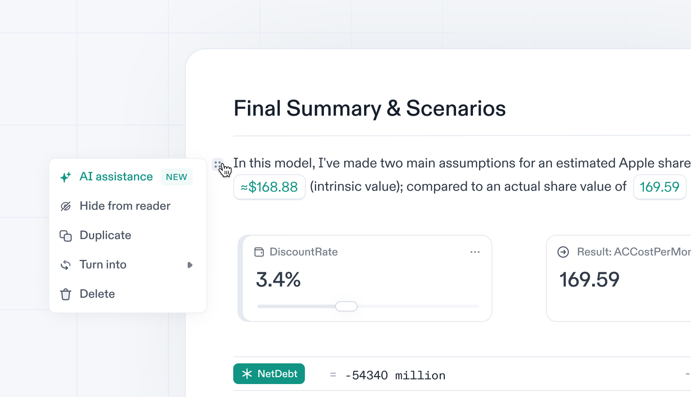

import { Stars, Hammer, FancyTitle } from '@site/src/components/FancyTitle';
import { ReleasePost } from '@site/src/components/ReleasePost';

## Code Integrations

<ReleasePost>

</ReleasePost>

We are excited to introduce a new feature that allows you to execute your own JavaScript code and retrieve data directly in your notebook. This feature gives you greater flexibility and more choices when it comes to building your model. Here's a simplified explanation of how it works:

- **Accessing the Code Editor:**
  - To access the code editor, simply type "/Integrations" in your notebook.
  - Select the "Code" option from the menu that appears.
- **Writing Custom Code:**
  - Once in the code editor, you can start writing your own JavaScript code to fetch the desired data.
  - Remember, you can use the "return" keyword to bring any result into your notebook.
- **Previewing and Adding the Result:**
  - After writing your code, preview the result to ensure it meets your expectations.
  - Once satisfied, you can add the result to your notebook.
  - The result will be added as a block.
  - You can assign a name to the block for easy reference, like a normal Decipad variable.

Your feedback matters! If you have any questions or thoughts about this new feature or our roadmap, click the help button in your notebook. We can't wait to hear from you!

## AI Assistant

<ReleasePost>

</ReleasePost>

With this release, we are also thrilled to introduce our first AI-powered feature. It helps you create the perfect accompanying paragraph for your model. Here's how you can use it:

- **Access the AI Assistance:**
  - Click on the block option button (::) on any paragraph you want to enhance.
  - From the options presented, select "AI Assistance."
- **Simplify and Fix Mistakes:**
  - Once in the AI Assistance, you can choose to simplify your sentences or fix any mistakes.
- **Custom Prompt:**
  - You can also use the provided field to enter a custom prompt for further assistance.

Give it a try and let us know your experience!

### <FancyTitle icon={Hammer}>Fixes and Improvements</FancyTitle>

- **Improved Help Docs**: Our Docs have been enhanced for better navigation. Now, there is a dedicated section for all Decipad functions and a special page with videos to explore. Additionally, all features have been divided into sections, making them easier to digest.
- **Enhanced Tables:** This release brings new improvements to tables.
  - **Improved Variable Representation:** Any table or column variable is now represented in blue, making it easier to distinguish from the common formula variables, which continue to be represented in teal.
  - **Compact Table Buttons:** Table buttons for hiding formulas and rows are now represented by their respective icons, reducing the space they occupy on your notebook.
  - **Improved Column Headers:** The issue with column widths changing when defining a data type has been fixed.
- **Improved Formatting:** Long number units are now properly formatted. For example, "$10 per month per dog" is now displayed correctly, instead of "$10 per month^-1 per dog^-1."
- **Bug Fixes and Stability Improvements:**
  - **Reduced Random Jumps:** The number of random jumps when interacting with the notebook blocks has been significantly reduced.
  - **Patched Workspace Navigation Error:** An issue causing random momentary errors when navigating to the workspace has been resolved.
  - **Fixed Random Number Catalog Flashes:** The occurrence of random flashes in the Number Catalog has been resolved.
  - **Patched Published Flow Bug:** A bug that prevented users from publishing new updates in some instances has been fixed.
