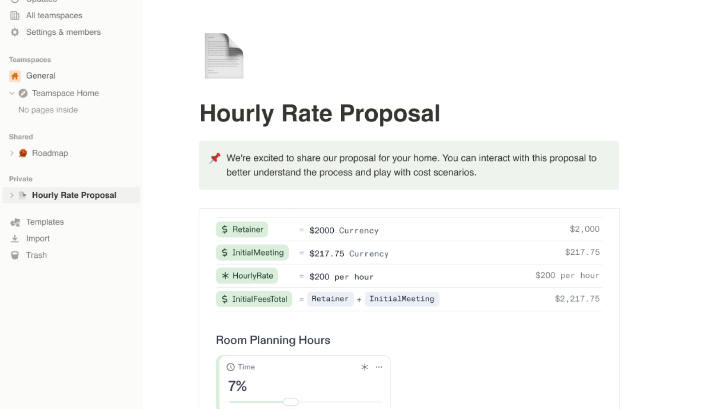

import { Stars, Hammer, FancyTitle } from '@site/src/components/FancyTitle';
import { ReleasePost } from '@site/src/components/ReleasePost';

<ReleasePost>

### Embed Decipad Notebooks (Beta)

Many users have asked for the ability to embed their notebooks to share insights with their team and integrate intuitive calculators. Now, you can do exactly that!

Simply publish your notebook, and in the sharing menu, you'll find an additional option to copy the notebook's embed link. We're introducing this feature on select apps such as Notion, ClickUp, monday.com, and Webflow.

If you have other apps in mind or wish to embed Decipad on your website, please reach out to us at [support@decipad.com](mailto:support@decipad.com).

[Find more about Decipad Embeds.](share/embeds)

### <FancyTitle icon={Hammer}>Fixes and Improvements</FancyTitle>

- Notebook loading times have been improved.
- Sidebar styles refined.
- Dropdown for tables in reading mode fixed.
- There was a bug in the language that computed a year as 360 days. This has been patched.

</ReleasePost>
