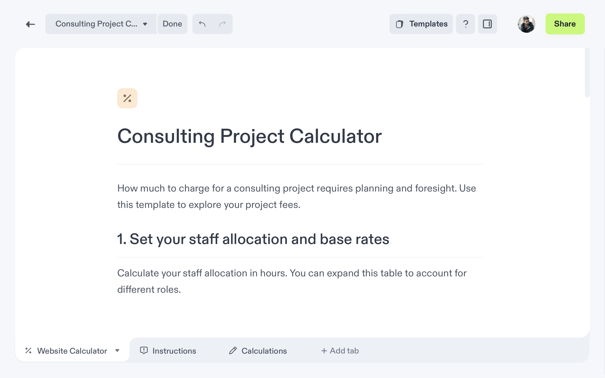

import { Stars, Hammer, FancyTitle } from '@site/src/components/FancyTitle';
import { ReleasePost } from '@site/src/components/ReleasePost';

<ReleasePost>

We're thrilled to unveil our latest feature – Notebook Tabs!

Tabs are here to transform the way you organize your notebooks, offering a world of convenience, improved collaboration, and efficient information management. With Tabs, you can say goodbye to scrolling through endless blocks and welcome a new era of notebook organization.

Here's what Tabs can do for you:

- **Stay Organized**:
  Tabs make organization a breeze. With just a few clicks, you can move your notebook blocks into distinct tabs that relate to specific topics, data sets or context.

- **Publish Better Reports**:
  Tabs aren't just about internal organization; they also empower you to create polished, professional reports. Hide auxiliary calculations and context that only your internal team needs to see by hiding tabs from readers.

- **Easier Navigation**:
  Tabs are accessible from anywhere within your notebook with just a single click. No more scrolling back and forth on your notebook; you can jump straight to the relevant section. Whether you're reviewing, collaborating, or presenting.

  [Lern more about tabs](/quick-start/notebooks#notebook-tabs)

### <FancyTitle icon={Hammer}>Fixes and Improvements</FancyTitle>

- You can now embed Google Slides, Pitch Decks, YouTube videos, and Loom videos on Decipad. [Learn more about embedding on Decipad](/quick-start/embed-on-decipad).
- Users with multiple workspaces can duplicate a notebook from one workspace to another.
- Result tables in advanced formulas now take up the full width of the block.
- Crashed blocks no longer show on published notebooks.
- Exported Notebook Backups: We have fixed an issue where exported notebook backups sometimes contained empty files.
- Collaboration and Publishing: We have resolved an issue where some users reported that notebooks lost their content when collaborating or publishing.

</ReleasePost>
