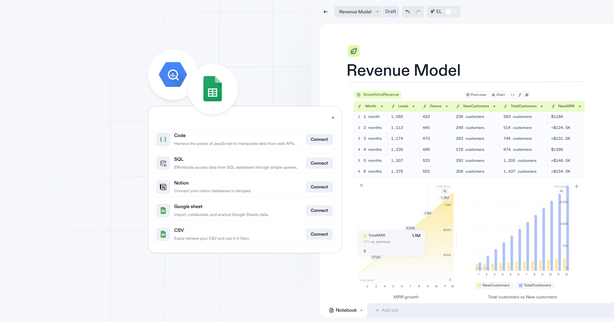

import { Stars, Hammer, FancyTitle } from '@site/src/components/FancyTitle';
import { ReleasePost } from '@site/src/components/ReleasePost';

<ReleasePost>

Our latest release is packed with two exciting integrations: Google Sheets and BigQuery! These integrations mark an important step toward one of our biggest priorities right now: enabling you to bring your data directly into Decipad to build live dashboards and models based on real-time data.

## Google Sheets Imports

One of our most requested features is finally here—our **Google Sheets Integration** allows you to easily import data from both public _and_ private Google Sheets, so your Decipad models are always up to date.

Here’s what you can expect:

- **Data importing:** Instantly pull in data from Google Sheets into your Decipad notebook and start turning your models into visual data stories.
- **Auto-refresh:** Keep your data fresh with just one click. Sync the latest updates from your Google Sheets into Decipad so your models always reflect real-time numbers.
- **Secure collaboration:** With private spreadsheet imports, you can work and collaborate securely on sensitive data.

[Learn more about Google Sheets Integrations](/integrations/google-sheets)

## Google BigQuery Imports

Our new **BigQuery Integration** unlocks the ability to query your BigQuery databases and bring your business data straight into your notebook.

- **Import with SQL:** Use SQL queries to pull data from BigQuery directly into Decipad. This allows you to work with large-scale datasets and retrieve the real-time data you need for your models.
- **Data modeling:** Importing from your BigQuery database will create a table with the retrieved data in your Decipad notebook. You can now play around with the numbers and start creating variables, graphs and a narrative around your model.

[Learn more about BigQuery & other SQL database imports](/integrations/SQL)

### <FancyTitle icon={Hammer}>Fixes and Improvements</FancyTitle>

- No need to remember function names in the data drawer - a new autocomplete menu will popup to help you finish your calculations.
- The data drawer now includes a helper tool showcasing all available functions on the side.
- Using `sum()` on a filtered column no longer causes crashes.

</ReleasePost>
