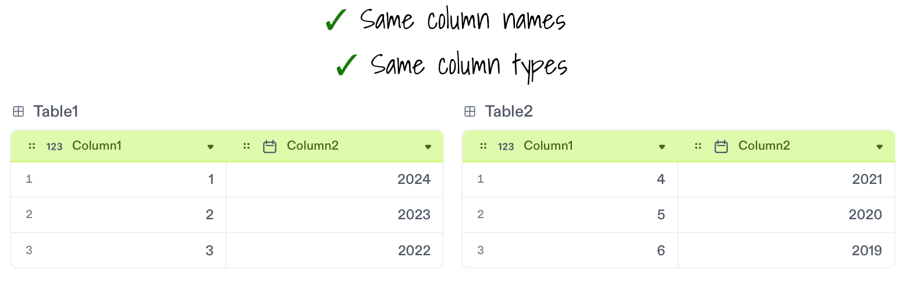
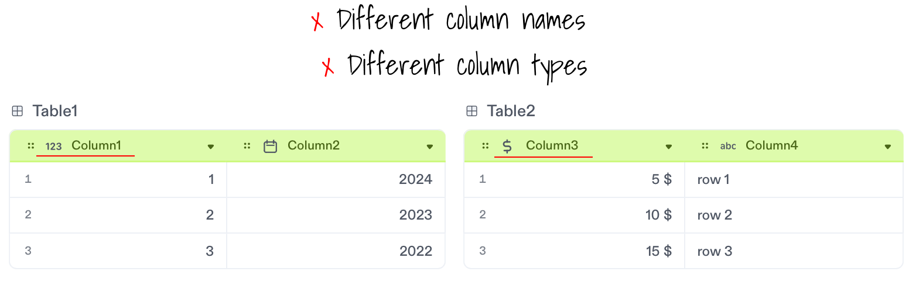
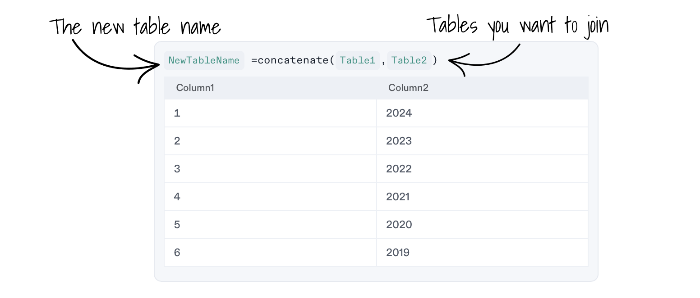
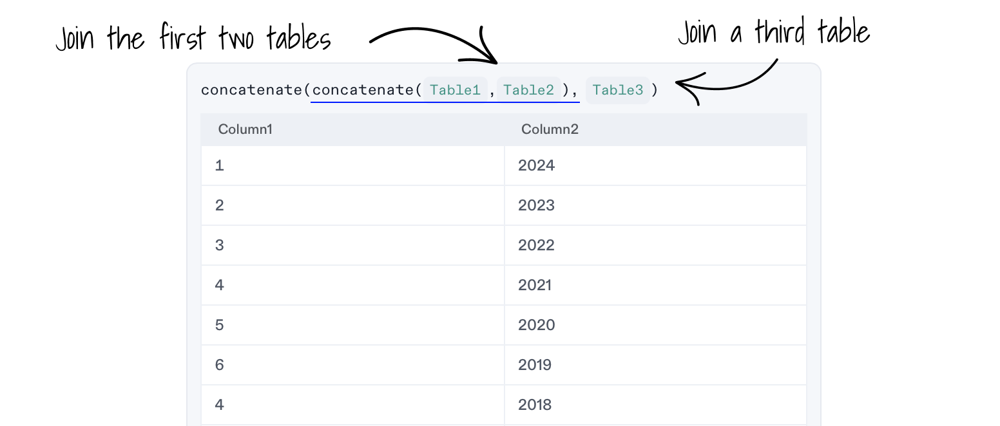

# Join Tables

The `concatenate()` formula lets you combine two or more tables.

**Syntax:** `concatenate( FirstTable, SecondTable )`

### 1. Check if your tables are compatible

To join two tables, **make sure both tables have the same column names and types**. The data in each table can be different.

Here is an example of two tables you can join.

Here is an example of tables you can't join, since the column names and data types in both tables are different.

Notice how the first column of `Table1` is a number column called `Column1` and the first column of `Table2` is a currency column called `Column3`. All columns should be the same in order to join `Table1` and `Table2`.

### 2. Add a Decipad Code Block

To use formulas, you will need a `Decipad Code Block`.

Add a **Decipad Code Block** from the block menu by typing `/calc` on an empty line or by pressing `+` and selecting `Calculations` from the menu.

### 3. Join two tables

Use the `concatenate()` formula with both tables' names as arguments to join the two compatible tables. Notice how you can create a new table with the result.

## 4. Join multiple tables

Easily combine more than 2 tables by chaining the `concatenate()` formula.

The `concatenate(Table1, Table2)` formula results on a table that you can reuse to join a third one.
