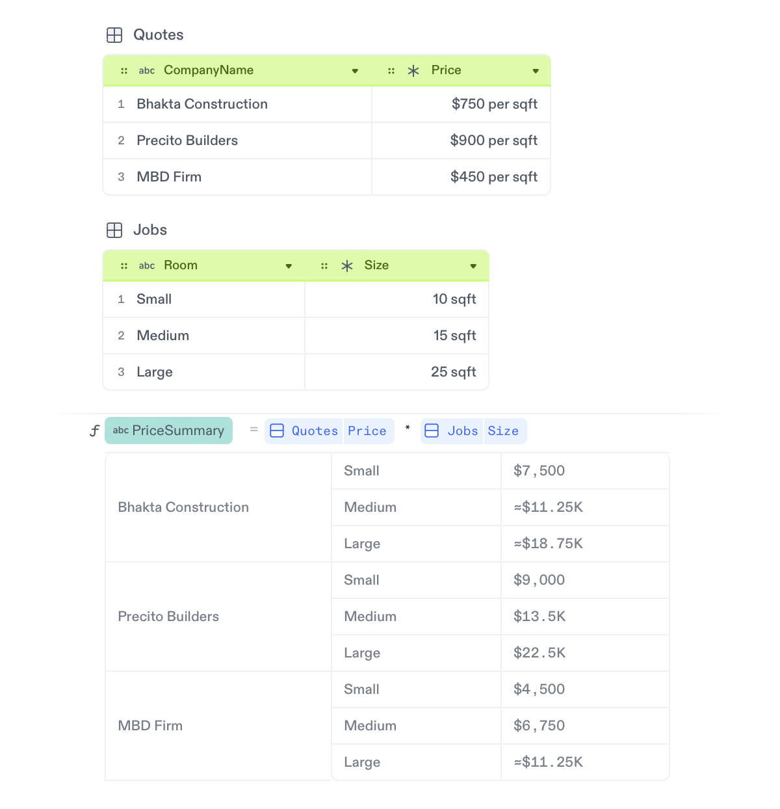
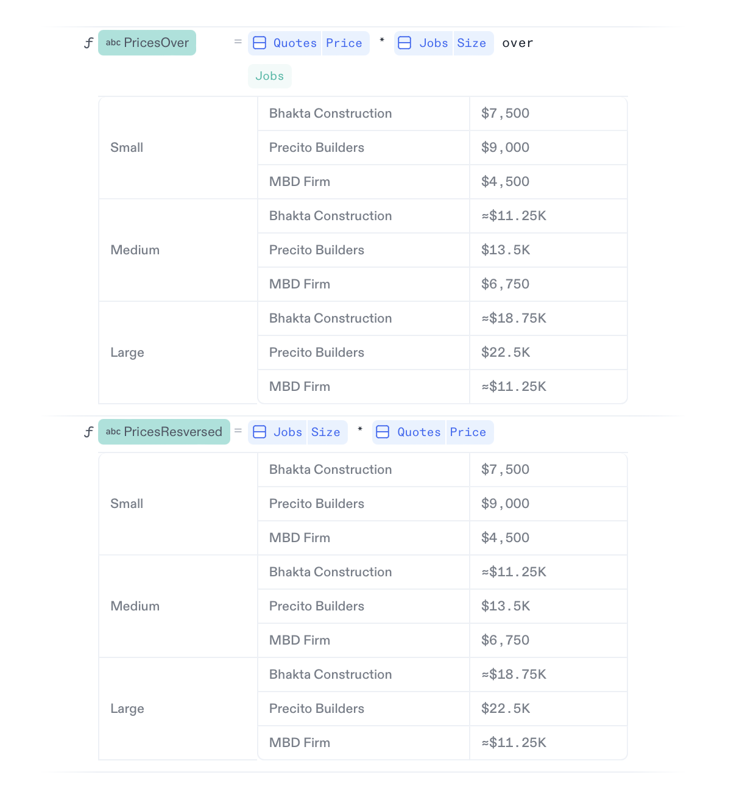

import { ReleasePost } from '@site/src/components/ReleasePost';

# Combinations

When you combine calculations from two columns, Decipad generates a summary table showing all scenarios. It's a convenient way to explore and showcase scenarios without creating every calculation manually.

<br />

:::note Example

Let's consider an example where you want to renovate your house and want to know how much it will cost you.

You have collected the inquire information in two tables. A first table called `Quotes` with quotes to renovate your house and a second table called `Jobs` with the type of room and the price per sqft. Your final job price will depend on the type of room you renovate and the company you go with.

To explore your options, Decipad let's you can combine both tables by multiplying the prices from the `Quotes` table with the prices from the `Jobs` table. The result is a table with a summary of the prices across both dimensions (company and job size).

<ReleasePost>



</ReleasePost>

Notice how `PriceSummary = Quotes.Price * Jobs.Size` calculates all combinations and creates a summary tables with every scenario based on the quotes and type of room.

If you go with "MBD the Firm" and a "Large" room, it will cost $11.25K.

:::

<!--
```deci live
Quotes = {
  CompanyName = ["Bhakta Construction", "Precido Builders", "MBD Firm"],
  Prices = [750 £/sqft, 900 £/sqft, 435 £/sqft]
}
==> {
  CompanyName = [ 'Bhakta Construction', 'Precido Builders', 'MBD Firm' ],
  Prices = [ 750 £/ft², 900 £/ft², 435 £/ft² ]
}
```

```deci live
Rooms = {
  Type = ["Small", "Medium", "Large"],
  Size = [10 sqft, 15 sqft, 25 sqft]
}
==> {
  Type = [ 'Small', 'Medium', 'Large' ],
  Size = [ 10 ft², 15 ft², 25 ft² ]
}
```

```deci live
Quotes = {
  CompanyName = ["Bhakta Construction", "Precido Builders", "MBD Firm"],
  Prices = [750 gbp/sqft, 900 gbp/sqft, 435 gbp/sqft]
}
Job = {
  Type = ["Small", "Medium", "Large"],
  Size = [10 sqft, 15 sqft, 25 sqft]
}
Quotes.Prices * Job.Size
==> [ [ 7500 £, 11250 £, 18750 £ ], [ 9000 £, 13500 £, 22500 £ ], [ 4350 £, 6525 £, 10875 £ ] ]
```

-->

## Format Combinations Results

Your combinations are organized based on the first table you use on your calculations. You can overwrite this with the keyword `over`.

:::note Example

Looking at our example, to showcase the quote prices based on the type of job instead of the construction company, you can use the keyword `over` to control which column come first: `Quotes.Prices * Job.Size over Job`.

Alternatively, you can invert the order of the multiplication since the first column is determined by the first term on the calculation: `Job.Size * Quotes.Prices`.

<ReleasePost>



</ReleasePost>

Notice how on this example the first column showcases the type of room instead of the company names. <br/> For a "Large" room a renovation with "MBD the Firm" will cost $11.25K.

:::

<!--
```deci live
Quotes = {
  CompanyName = ["Bhakta Construction", "Precido Builders", "MBD Firm"],
  Prices = [750 gbp/sqft, 900 gbp/sqft, 435 gbp/sqft]
}
Job = {
  Type = ["Small", "Medium", "Large"],
  Size = [10 sqft, 15 sqft, 25 sqft]
}
Quotes.Prices * Job.Size over Job
==> [ [ 7500 £, 11250 £, 18750 £ ], [ 9000 £, 13500 £, 22500 £ ], [ 4350 £, 6525 £, 10875 £ ] ]
```

-->
