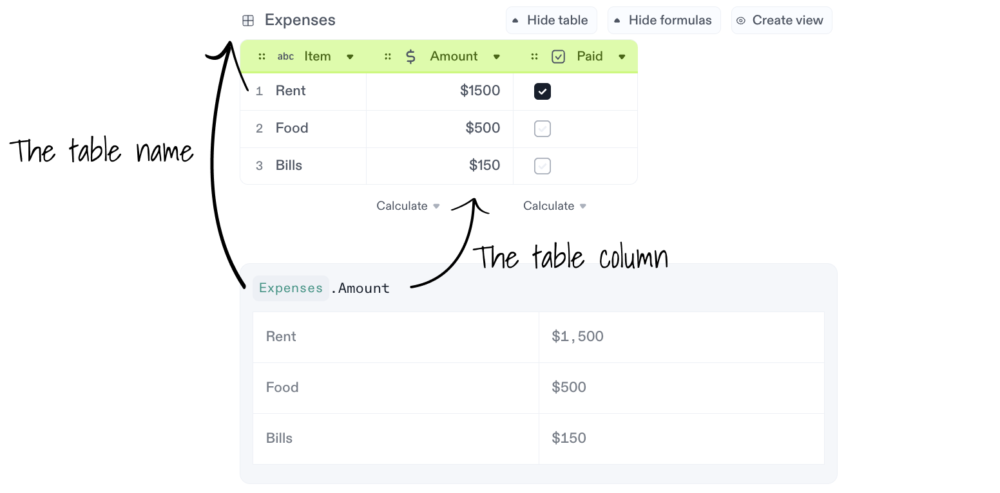

# Formulas for Table Columns

You may want to reduce the number of columns to a given value.

### Get a Table column

To select a table column, just type the table name on a calculation, folowed by a `.` and the column name.



On this example, we are selecting the column `Amount` from the table `Expenses`.

## count()

You may simply want to count number of entries on a list or column:

```deci live
Errands = ["make bread", "walk dog", "do homework"]

count(Errands)
==> 3
```

## countif()

You may simply want to count the number of entries that respect a certain condition:

```deci live
Flights = {
  Number = ["TP123", "BA456", "EJ789"]
  PassengerCount = [100, 150, 200]
}


countif(Flights.PassengerCount > 100)
==> 2
```

## sum() / total()

You may want to sum up an entire column:

```deci live
Flights = {
  Number = ["TP123", "BA456", "EJ789"]
  PassengerCount = [100, 150, 200]
}

sum(Flights.PassengerCount)
==> 450
```

> `total` is the name of the function that does exactly the same as `sum`, so you can use that instead.

## sumif()

You may want to sum up an entire column only for the elements that respect a certain condition:

```deci live
Flights = {
  Operator = ["TP", "EJ", "BA", "TP"]
  Number = ["TP123", "BA456", "EJ789", "TP101"]
  PassengerCount = [100, 150, 200, 75]
}

sumif(Flights.PassengerCount, Flights.Operator == "TP")
==> 175
```
