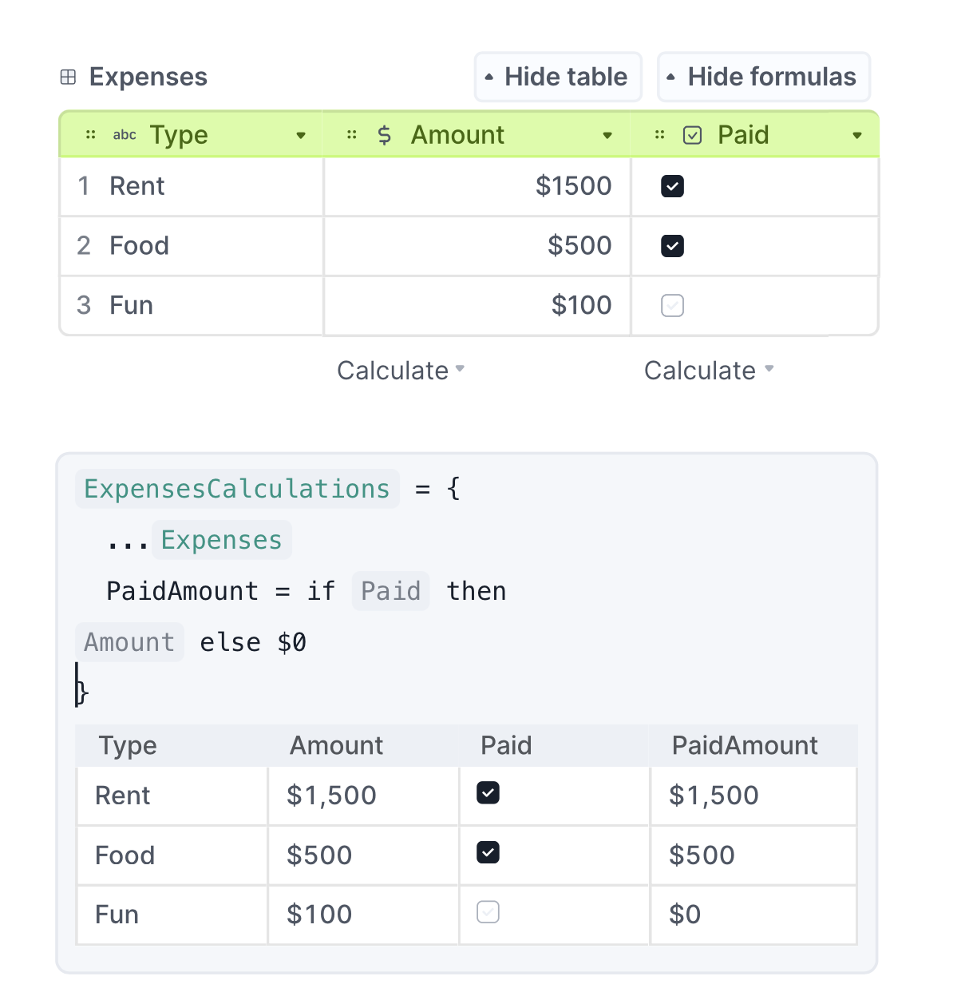
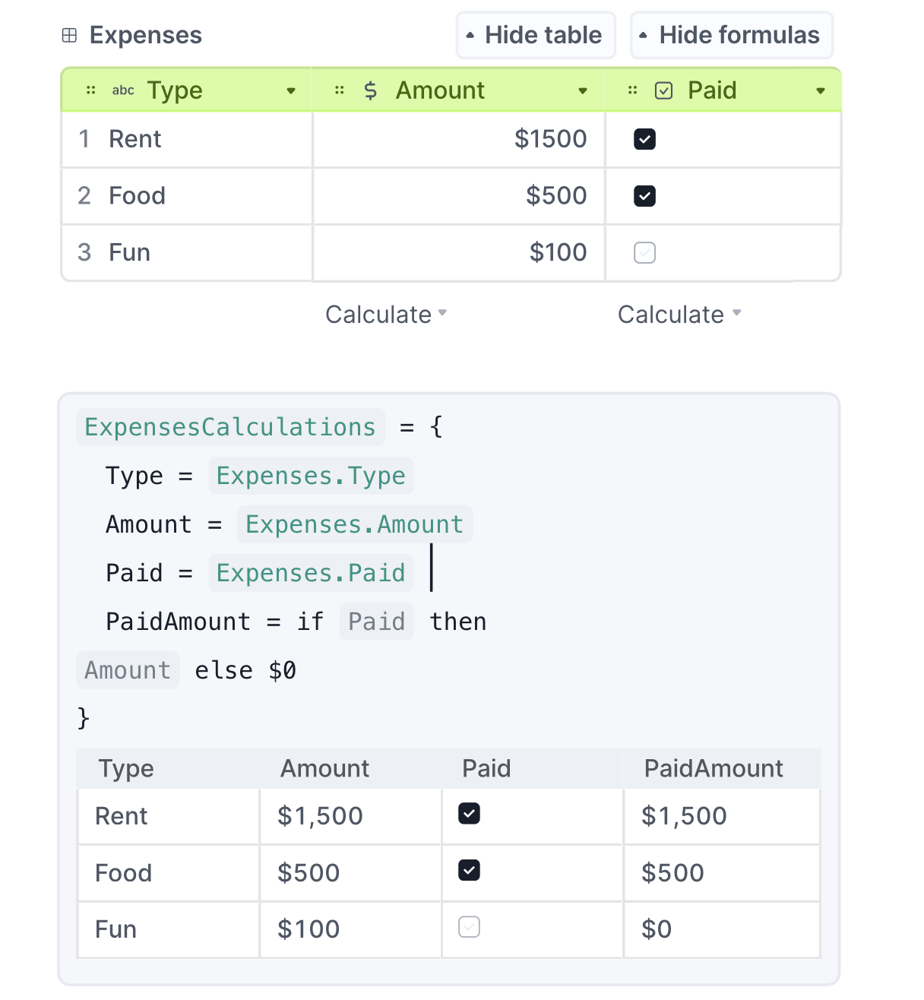
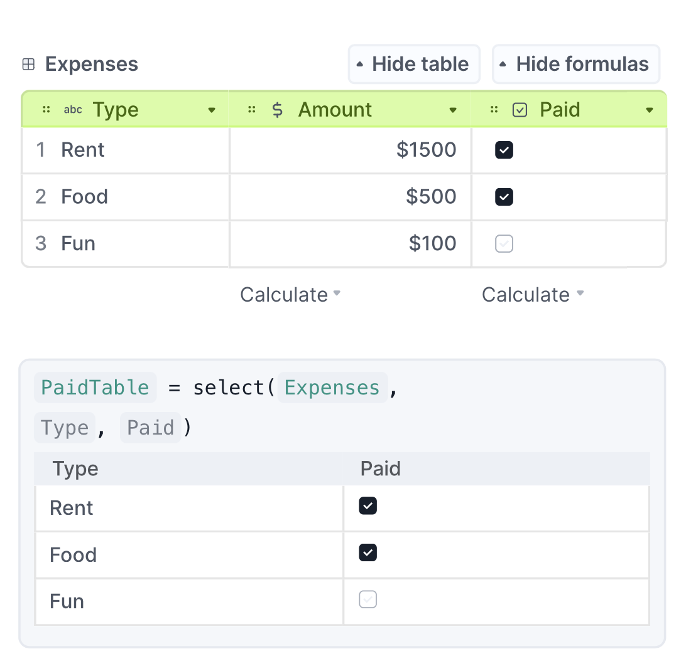
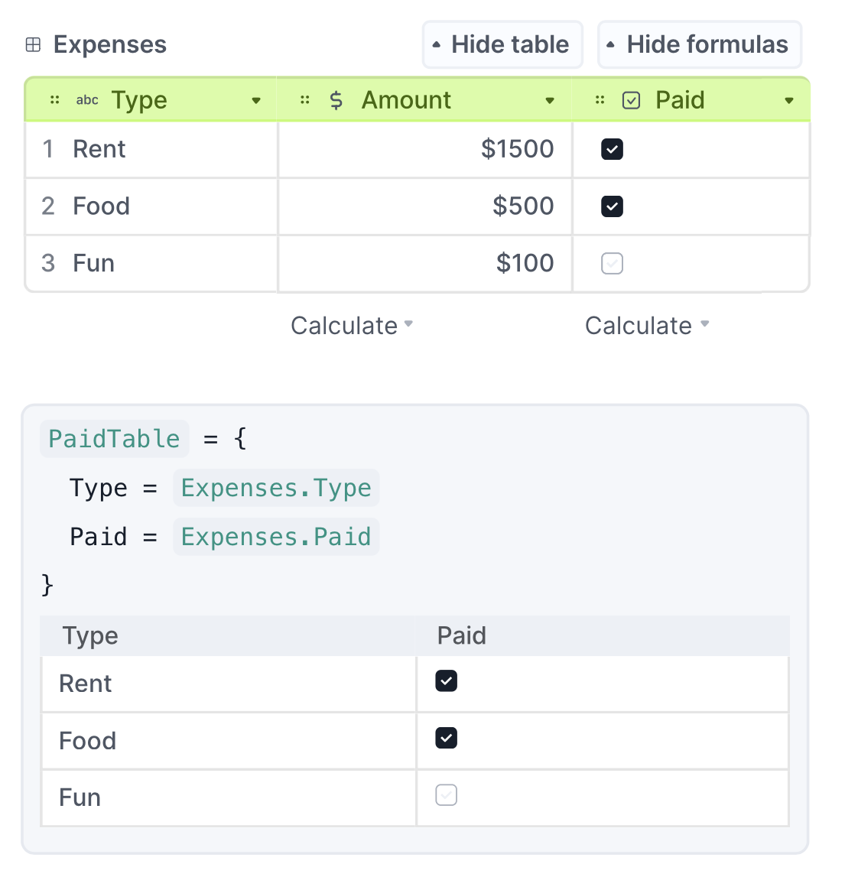
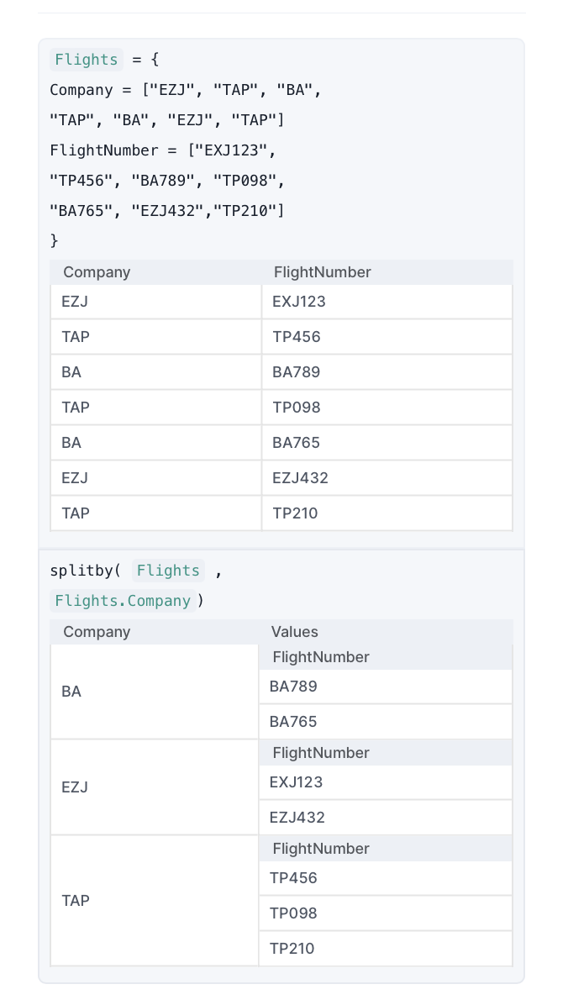
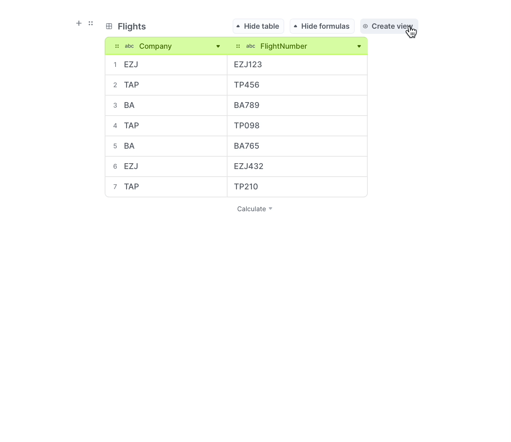

# Retired Feature

On Decipad, we are always improving and experimenting with new features.

Our goal is to give you superpowers when it comes to numbers, and to make them fun and intuitive.
This sometimes means, retiring old features to make space for new and better ones.

## Expanding Tables

Expanding tables would let you take an original language table and reuse its columns on a new one.
You can achieve the same result by creating a new table and adding columns that match the columns you want to copy.

#### Retired Version

#### New Version

1.  **Create a new table** and fill in your old data
2.  **Add columns** and assign the columns you want to copy

## Select() Formula

The select() formula would let you create a copy of a table with some o of the original columns.
You can achieve the same result by creating a new table and adding columns that match the columns you want to copy.

#### Retired Version

#### New Version

1.  **Create a new table** and fill in your old data
2.  **Add columns** and assign the columns you want to copy
    

## Splitby() Formula

The splitby() formula would let you organize a language table by the labels on a column.
You can achieve the same result with data views.

#### Retired Version

#### New Version

1.  **Create a new table** and fill in your old data
2.  **Create a view** to filter

## Contact Support

- **Via Chat:** Click the **?** on the bottom right of your notebook to talk to the team
- **Via Email:** [support@decipad.com](mailto:support@decipad.com)
- **On Discord:** Join our discord [here](https://discord.gg/CUtKEd3rBn)
