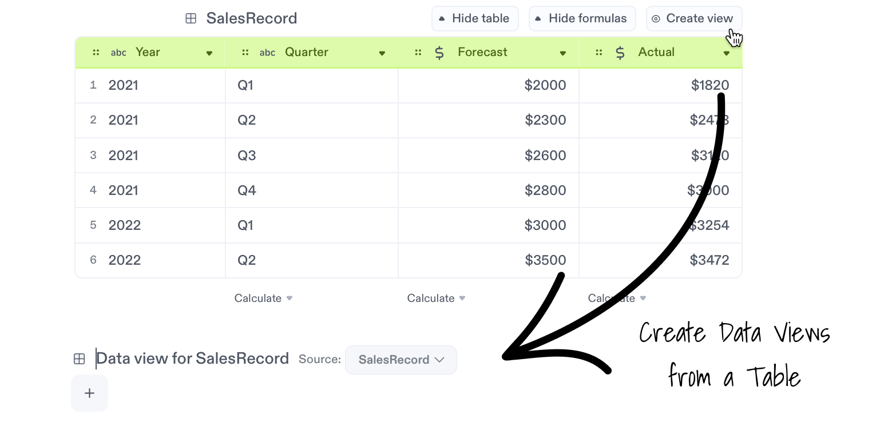

import {
  avatarFabio,
  avatarGiulia,
  avatarSimao,
  avatarPeyton,
  avatarKelly,
  avatarJohn,
  avatarNuno,
  avatarAnna,
  templateBadge,
  educationBadge,
  IconAnnouncement,
  IconHeart,
  IconPin,
  IconShoppingCart,
  IconCoffee,
  IconWorld,
  IconTable,
  IconAnnotationWarning,
  IconFrame,
  IconPaperclip,
  IconWallet,
  IconStar,
  IconCrown,
  IconBattery,
  IconHappy,
  IconKey,
  IconMoon,
  IconLightBulb,
  IconHealth,
  IconCard,
  IconMusic,
  IconMovie,
  IconPeople,
  IconServer,
  IconLeaf,
  IconClock,
  IconPercentage,
  IconBolt,
  IconCar,
  IconMessage,
  IconSunrise,
  IconCompass,
  IconTrophy,
  IconVirus,
  IconPlane,
  IconEducation,
  IconSpider,
  IconRocket,
  IconSparkles,
  IconBeach,
  newNotebookBadge,
  GridContainer,
  Card,
} from '@site/src/components/GalleryCards';

# Create a Data View

Data views are a quick and easy way to create summarized snapshots from a table to help you present meaningful insights:

- Aggregate and showcase data in a way that is easy to understand.
- Reuse data from a data view to build a dynamic story in minutes. Just drag and drop.
- Data views dynamically update, making it easy to keep your data up to date and accurate.

*Learn data views in 3 minutes*

  <iframe src="https://www.loom.com/embed/5fe935de0c624a1caf992ec7b6bd09b6" frameBorder={0} webkitallowfullscreen mozallowfullscreen allowFullScreen style={{position: 'absolute', top: 0, left: 0, width: '100%', height: '100%'}} />

## 1. How to create a data view

**To add a data view from a table**, click the `Create view` button on the top right of any table and a data view will be added onto the next line.

**You can also create a data view manually** by typing `/data` on a new line and selecting `Data View`. Once a data view has been placed, use the `Source` menu to pick any table to connect.

## 2. Build your data view by adding columns

Use the `+` button to add columns of data you want to showcase. Once placed, you can always drag your columns into another order or remove them.

To make it easy to create summaries, the order of your columns shape your Data View, since repeated values are nested together.

Take a look at this example, with the same data, you can explore *Sales per Year* or *Sales per Quarter*, just by changing the order of your columns.

## 3. Aggregate information

Click the down triangle button on a column and select any operation from `Aggregate`.  This helps you add new rows with totals to any group of information.

## 4. Reuse data from a view with drag and drop

Hover any result until your pointer turns into a hand and drag that number into your text or any calculation block.

## 5. Live Updates

When you make changes to your source table, data views will sync and reflect your changes, so your data is always up to date.

## Notebook Examples

Explore Notebooks that take advantage of Data Views to present quick insights.

<GridContainer>
              <Card
                author="Kelly McEttrick"
                cardColor="--card-yellow"
                icon={IconLeaf}
                title="Sales Pipeline Report"
                img="https://user-images.githubusercontent.com/12210180/162471244-15b6b5ba-5ed3-45ee-a6e0-475d1b018053.png"
                notebook="https://app.decipad.com/n/-Template-Sales-Report-Monthly-Pipeline-Update%3ABxUws8V5ImNdj3feqCevN"
                description="Build a report to showcase the current and future state of your sales funnel using data views."
                template
                avatar={avatarKelly}
              />
              <Card
                author="Simão Dias"
                cardColor="--card-green"
                icon={IconLeaf}
                title="Finance Tracker"
                img="https://user-images.githubusercontent.com/12210180/162471244-15b6b5ba-5ed3-45ee-a6e0-475d1b018053.png"
                notebook="https://app.decipad.com/n/-Template-My-Finance-Tracker-2023%3AA5sV922M9Qtn71KoDdHzO"
                description="Input your expenses and income to get a detailed summary of cashflows using data views."
                template
                avatar={avatarSimao}
              />
            </GridContainer>
