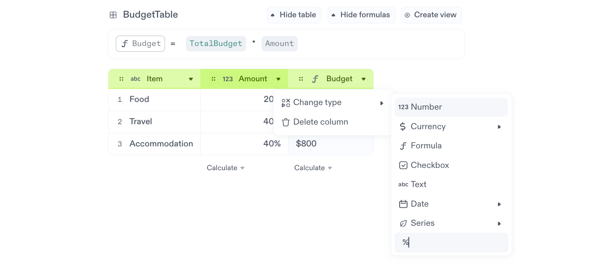
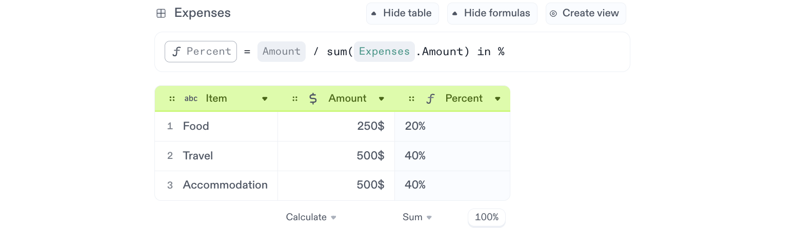

# Percentages

Percentages work with calculation, tables and widgets.

## Define any number as a percentage

Use the `%` symbol with any number to tell Decipad that number is a percentage.

## Turn a calculation result into a percentage

Transform any result into a percentage using **in %**

On this example, we are checking how much of the budget was spent and getting that result in a percentage format using **in %**.

## Use Percentages on Calculations

Percentages work natively with any operation.

**Apply a percentage** with multiplication. **10%** of **5** is **0.5**.

**Add a percentage** with addition. Increasing **5**, **10%** is **5.5**.

**Subtract a percentage** with subtraction. Reducing **5**, **10%** is **4.5**.

**Combine percentages** with addition or subtraction.

### Define percentages on a column

**To define a column with percentages**, change the column type and specify `%` in its custom field.

On this example, we are using the column `Amount` to specify the `Budget` as a percentage.

### Calculate the percentage for each item in a column

**To calculate the percentage value of each row item**. Add a new column that divides your column by its total amount.

On this example, we are using the column `Percent` to check the percentage of each `Expense`.
