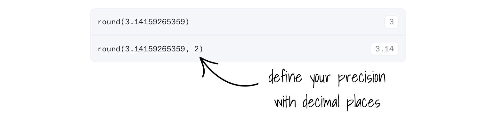
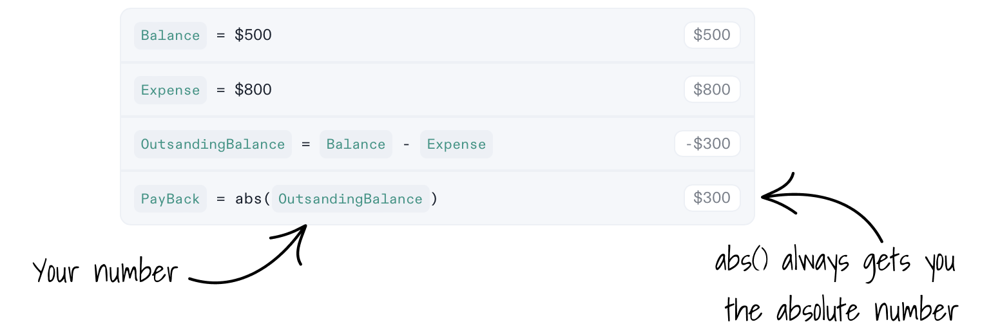

# Formulas for Numbers

Decipad has a collection pre-built formulas that help you work with numbers. <br /> You can use these formulas with [tables](/docs/quick-start/tables), formulas and [Decipad Advanced Formula blocks](/docs/advanced-concepts/advanced-formulas).

## Rounding numbers

### Round a number - round()

The `round()` formula gives you a rounded version of a number. Optionally, you can specify the number of decimal places.

**Syntax:** `round( Number, Optional Decimal Precision)`



### Round a number up - roundup() / ceil()

Rounds the number to the nearest largest integer or number with the given decimal places.

**Syntax:** `roundup( Number, Optional Decimal Precision )`

**Alternative Syntax:** `ceil( Number, Optional Decimal Precision )`

```deci live
roundup(2.3)
==> 3
```

```deci live
roundup(5.2345, 2)
==> 5.24
```

### Round a number down - rounddown() / floor()

Rounds the number to the nearest smallest integer or number with the given decimal places.

**Syntax:** `roundown( Number, Optional Decimal Precision )`

**Alternative Syntax:** `floor( Number, Optional Decimal Precision )`

```deci live
rounddown(2.9)
==> 2
```

```deci live
rounddown(5.789, 2)
==> 5.78
```

## Square root - sqrt()

The `sqrt()` formula gives you the square root of your number.

**Syntax:** `sqrt( Number )`

Take a look at this example, `3 feet` is the square root of `9 square feet`.


## Get an absolute number - abs()

The `abs()` formula gives you the absolute value of a number. <br /> It is useful when you need to remove the negative sign from a number.
If your number is positive or zero, it stays the same. If it's negative, it removes the negative sign.

**Syntax:** `abs( Number )`

Take a look at this example, `20$` is the absolute value of `-$20`.


Take a look at this practical example, where you check how much money you would need to get a positive balance back.



## Trignometric formulas

[Trigonometric formulas](https://en.wikipedia.org/wiki/List_of_trigonometric_identities) relate an angle of a righ-angled triangle with the ratios of two side lengths. Decipad supports adians and degrees. These can be used to triangulate distances for example.

### sin() / asin()

```deci live
sin(90degrees)
==> 1
```

```deci live
asin(1) in degrees
==> 90.0000 °
```

### cos() / acos()

```deci live
cos(2*pi)
==> 1
```

```deci live
acos(1)
==> 0 rad
```

### tan() / atan()

```deci live
tan(45degrees)
==> 1
```

```deci live
round(atan(1) in degrees)
==> 45 °
```

## Calculate a factorial - factorial()

Compute factorials with the `factorial()` formula. Factorials are commonly used with probabilities.

```deci live
factorial(5)
==> 120
```

## Natural logarithm - ln()

The `ln()` formula gives you [the natural logarithmic of a number](https://en.wikipedia.org/wiki/Natural_logarithm).

**Syntax:** `ln( Number )`

```deci live
ln(12)
==> 2.4849
```
