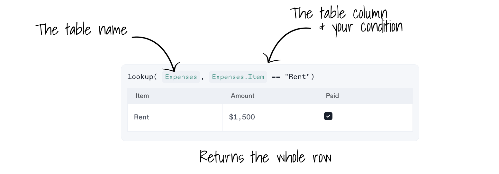
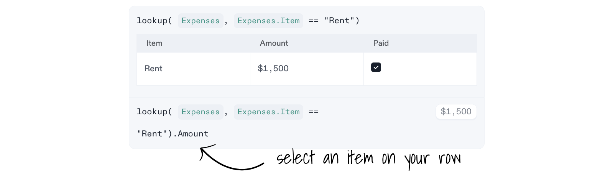

# Formulas for Tables

Built-in functions that operate on tables.

## Table lookups - lookup()

The `lookup()` formula lets you access rows and values from a table to inspect or reuse.

**Syntax:** `lookup( Table, Table Column Condition )`

* **Table** specifies your target table.
* **Table Column Condition** defines a searching condition to match.

Let's explore an example where we select the **Rent Amount** from the `Expenses` table.

### 1. Select a table row

**To select a table row**, use the formula `lookup()` on a calculation block, where you specify the table name on the first parameter and the condition to search on the second one.

* On the first parameter specify the table name. In this example, the table `Expenses`.
* On the second parameter specify a condition to match the table column. In this example, the row where `Expenses.Item` is equal to `"Rent"`.

### 2. Select a value from a row

**To select a value from a row**, add a dot `.` at the end of the formula `lookup()` with the name of the column you want to select.

On this example we specify `.Amount` to select `$1,500`.

## Filter a table - filter()

The `filter()` formula lets you filter the values from a table.

**Syntax:** `filter( Table, Table Column Condition )`

* **Table** specifies your target table.
* **Table Column Condition** defines a searching condition to match.

In this example, two rows are returned, since both match `Expense.Amount` less or equal to `$500`.

## Reorder table rows 

### Sort Table rows by column - sortby()

The `sortby()` formula lets you reorder table rows based on any column.

**Syntax:** `sorby( Table, Table Column )`

* **Table** specifies your target table.
* **Table Column** defines the column.

Notice how on this example, the returned table has its row ordered by `Expenses.Item`.

### Reverse table rows order - reverse()

The `reverse()` formula reverts the order of your table rows.

**Syntax:** `reverse( Table)`

* **Table** specifies the table to revert.

Notice how on this example, the returned table has its row order reversed, compared to the original table.
