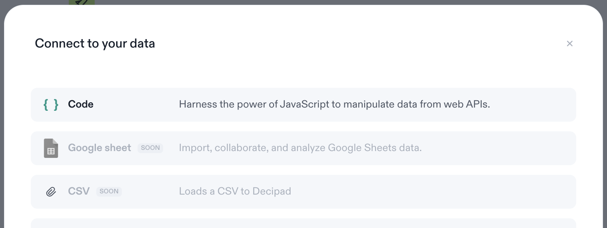
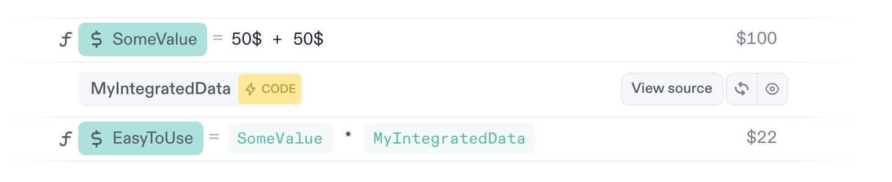

# Data Integration Basics

Decipad aims to let you work with any data you may already have. Integrations allow you to connect, or bring in to Decipad a variety of Data Sources.

## Adding an Integration

As with all data in Decipad, an integrated Dataset will live in your notebook as a block. We call these Integration Blocks. In order to bring in your data, insert an Integration Block via the Slash-Command Menu. Just hit `/` and either scroll to the option, or start typing "/integrations" to filter the list right away:

## Choosing the Data Source

You will be greeted by a dialogue that lets you choose what type of data you want to bring in. We are continuously adding options here, so be sure to check the live product to see what is available at any given time.

## Fetching your Data

Once you chose the type of data you want to bring in, we will guide you through the process step-by-step. In general, this will be a three step process. Depending on the source, some steps might be omitted or merged.

- Establish the Connection
- Select the Data
- Preview the Result

Once you are happy with your import, you can add the dataset as an integration block that will look somewhat like this:

Besides allowing you to edit the name for your data, you can also re-open the configuration with the according button. In this example we used a code integration, so the button is labeled "View source". Depending on the integration type, the label of the button can differ, but it will always bring you back to configuring your data. The "refresh"-button allows you to manually re-fetch the data. Last, but not least, the "preview"-button lets you show or hide your integrated data.

## Using Integrated Data

Integration blocks are easy to re-use throughout your notebook just like any other value:

