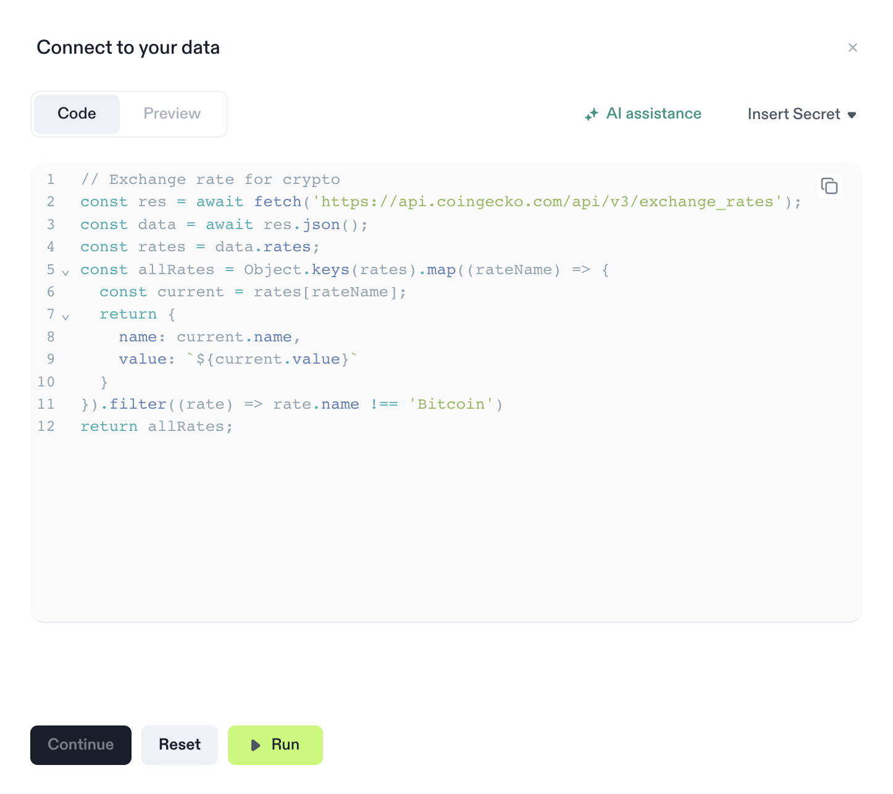
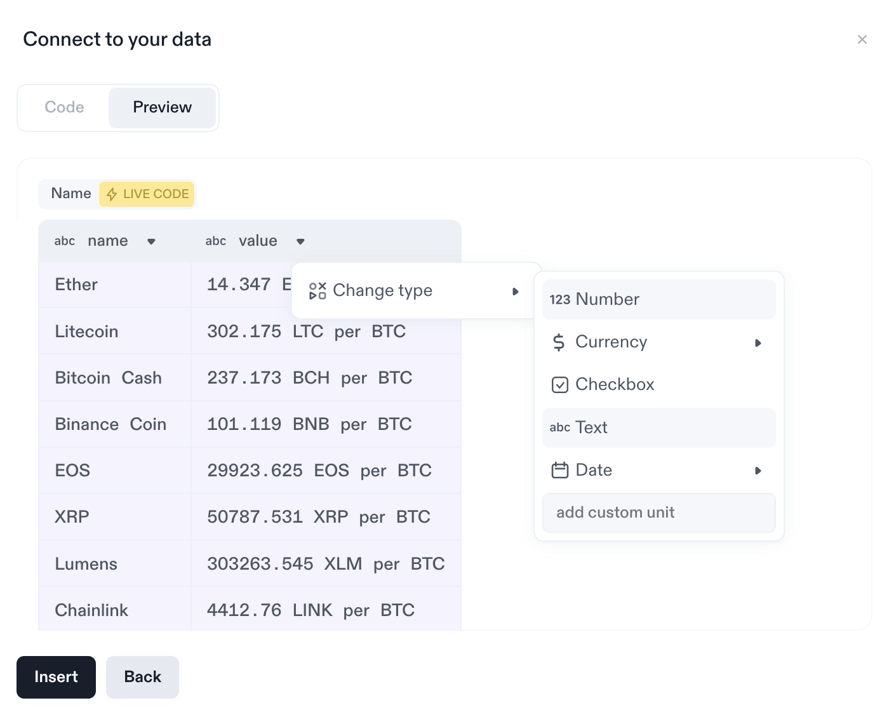

# Code: Data from APIs

  <iframe src="https://www.loom.com/embed/ba7b55cabaf1403fab00183f2ad8bfb7" frameBorder={0} webkitallowfullscreen mozallowfullscreen allowFullScreen style={{position: 'absolute', top: 0, left: 0, width: '100%', height: '100%'}} />

 

Retrieve data from web APIs and import it into Decipad using our Code Integration feature. To create a code integration, add a new integration block and choose "Code" (see [Integration Basics](/docs/integrations/basics) for details). In the code editor, you'll find an example that showcases how to fetch data from a public web API:

## Running Code

In order to get data from a code integration into your document, you need to first run the code with the "Run"-button. Once ran, you can then continue to the result preview either via the navigation bar, or the "Continue"-button. Upon running the code, we will show you a small console at the bottom of the code block so you get feedback on any errors that may occur.

## Previewing Data

On the preview pane you will see the result and the format it will be available in in your document. Here you can change the type of the columns or simple result, and make sure that you actually got the data you wanted. Once done with this step, the "Insert"-button will give you a new integration block that you can re-use in your document just like any other variable (see [Integration Basics](/docs/integrations/basics) for details).

## Private Keys (Coming Soon)

We have a future update planned that will introduce the option to specify private keys, ensuring secure reuse within your code. With this feature, you will be able to protect your API setup and restrict access from unauthorized users. Stay tuned for more information on how to utilize private keys effectively or contact us via [support@decipad.com](mailto:support@decipad.com).
