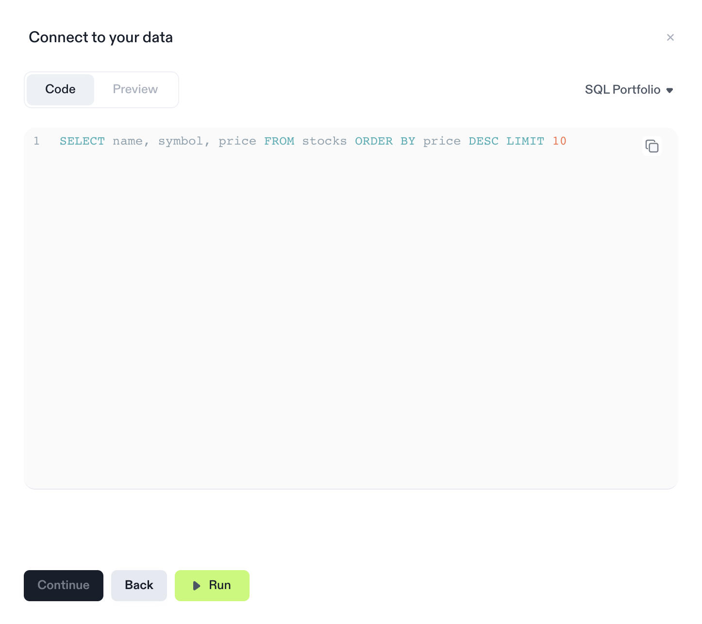

# Code: Data from SQL

import YouTubePlayer from '@site/src/components/VideoCards/videos';

<YouTubePlayer videoId="irTKNI61DPA" thumbnailUrl="/docs/img/thumbnails/thumbnail-sql-integrations.png" />

 

## Database Connections

To create a SQL integration, you first need to set up a database connection on the workspace level. To do this, go to your workspace and select "Data Connections" from the sidebar menu. After configuring and saving your connection, it will the be available for querying in all notebooks in your workspace.

## Querying Data in a Notebook

To create a SQL integration, add a new integration block and choose "SQL" (see [Integration Basics](/docs/integrations/basics) for details). In the SQL editor, you can then compose your query.

In order to get data from the SQL integration into your document, run the code with the "Run"-button. Running the code will show a small console so you get feedback if errors occur. Once ran successfully, you can then continue to the result preview either via the navigation bar, or the "Continue"-button.

## Previewing Data

On the preview pane you see the result and the format it will be available in. Here you can change the data type of your result, and verify that you actually got the data you wanted. Once done with this step, the "Insert"-button will give you a new integration block that you can then re-use in your document just like any other variable (see [Integration Basics](/docs/integrations/basics) for details).
