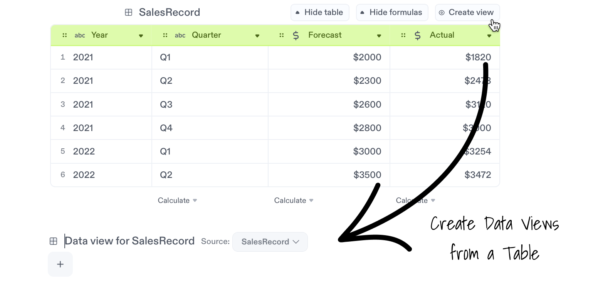
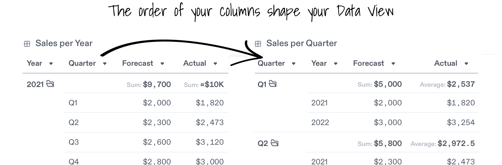
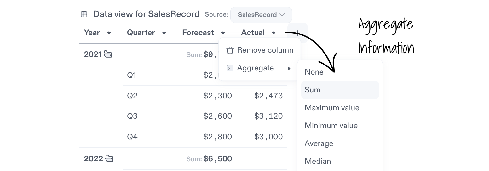
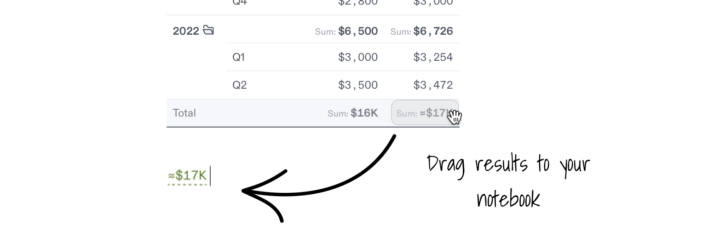

import {
  avatarFabio,
  avatarGiulia,
  avatarSimao,
  avatarPeyton,
  avatarKelly,
  avatarJohn,
  avatarNuno,
  avatarAnna,
  templateBadge,
  educationBadge,
  IconAnnouncement,
  IconHeart,
  IconPin,
  IconShoppingCart,
  IconCoffee,
  IconWorld,
  IconTable,
  IconAnnotationWarning,
  IconFrame,
  IconPaperclip,
  IconWallet,
  IconStar,
  IconCrown,
  IconBattery,
  IconHappy,
  IconKey,
  IconMoon,
  IconLightBulb,
  IconHealth,
  IconCard,
  IconMusic,
  IconMovie,
  IconPeople,
  IconServer,
  IconLeaf,
  IconClock,
  IconPercentage,
  IconBolt,
  IconCar,
  IconMessage,
  IconSunrise,
  IconCompass,
  IconTrophy,
  IconVirus,
  IconPlane,
  IconEducation,
  IconSpider,
  IconRocket,
  IconSparkles,
  IconBeach,
  newNotebookBadge,
  GridContainer,
  Card,
} from '@site/src/components/GalleryCards';

# Data Views

Data views allow you to create summarized snapshots from a table, making it easy to present meaningful insights.

import YouTubePlayer from '@site/src/components/VideoCards/videos';

<YouTubePlayer
  videoId="m8Y7bZgSq6w"
  thumbnailUrl="/docs/img/thumbnails/thumbnail-data-views.png"
/>

## Create a Data View

### 1. Add a new data view

- To add a data view from a table, click the `Create view` button on the top right of any table, and a data view will be added below.
- Alternatively, you can manually create a data view by typing `/data` on a new line and selecting `Data View`. Use the `Source` menu to connect it to any table.

### 2. Build your data view by adding columns

- Use the `+` button to add columns of data that you want to showcase.
- Drag the columns to rearrange their order or remove them as needed.
- The order of your columns shapes the data view and determines how repeated values are nested together.

### 3. Aggregate information

- Click the down triangle button on a column and select an operation from the `Aggregate` menu.
- This allows you to add new rows with totals for any group of information.

### 4. Reuse data from a view with drag and drop

- Hover over a result in the data view until your pointer turns into a hand.
- Drag the number into your text or any calculation block to use it.

### 5. Live Updates

- Data views automatically sync and reflect changes made to the source table.
- This ensures that your data views are always up to date with the latest information.

## Notebook Examples

Explore Notebooks that take advantage of Data Views to present quick insights.

<GridContainer>
  <Card
    author="Kelly McEttrick"
    cardColor="--card-yellow"
    icon={IconLeaf}
    title="Sales Pipeline Report"
    img="https://user-images.githubusercontent.com/12210180/162471244-15b6b5ba-5ed3-45ee-a6e0-475d1b018053.png"
    notebook="https://app.decipad.com/n/-Template-Sales-Report-Monthly-Pipeline-Update%3ABxUws8V5ImNdj3feqCevN"
    description="Build a report to showcase the current and future state of your sales funnel using data views."
    template
    avatar={avatarKelly}
  />
  <Card
    author="Simão Dias"
    cardColor="--card-green"
    icon={IconLeaf}
    title="Finance Tracker"
    img="https://user-images.githubusercontent.com/12210180/162471244-15b6b5ba-5ed3-45ee-a6e0-475d1b018053.png"
    notebook="https://app.decipad.com/n/-Template-My-Finance-Tracker-2023%3AA5sV922M9Qtn71KoDdHzO"
    description="Input your expenses and income to get a detailed summary of cashflows using data views."
    template
    avatar={avatarSimao}
  />
</GridContainer>
