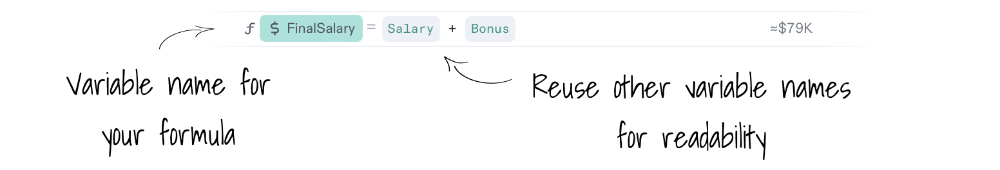
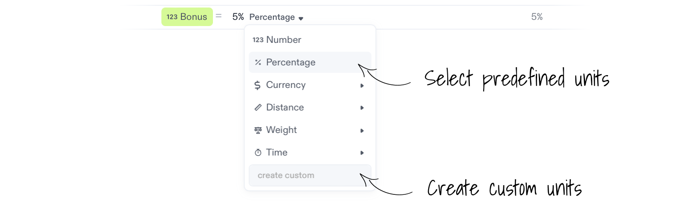

import {
  avatarFabio,
  avatarGiulia,
  avatarSimao,
  avatarPeyton,
  avatarKelly,
  avatarJohn,
  avatarNuno,
  avatarAnna,
  templateBadge,
  educationBadge,
  IconAnnouncement,
  IconHeart,
  IconPin,
  IconShoppingCart,
  IconCoffee,
  IconWorld,
  IconTable,
  IconAnnotationWarning,
  IconFrame,
  IconPaperclip,
  IconWallet,
  IconStar,
  IconCrown,
  IconBattery,
  IconHappy,
  IconKey,
  IconMoon,
  IconLightBulb,
  IconHealth,
  IconCard,
  IconMusic,
  IconMovie,
  IconPeople,
  IconServer,
  IconLeaf,
  IconClock,
  IconPercentage,
  IconBolt,
  IconCar,
  IconMessage,
  IconSunrise,
  IconCompass,
  IconTrophy,
  IconVirus,
  IconPlane,
  IconEducation,
  IconSpider,
  IconRocket,
  IconSparkles,
  IconBeach,
  newNotebookBadge,
  GridContainer,
  Card,
} from '@site/src/components/GalleryCards';

# Create a Formula

Create inline calculations in your notebook with `Formula Blocks`, they can help you:

- Label your data clearly - instead of using "$A$1", you can use formulas that read like a story
- Define the base values of your model so you can build from them and avoid accidentally overwriting your input data.
- Rearrange your formulas as you please - either in a compact list or placed where they make the most sense contextually, like cells but unchained.

## Add a Formula Block to you Notebook

To **add a new formula** to your notebook:

1.  Click the `+` button next to an empty line,
2.  Select `Formula` from the menu.

Alternatively, use the shorcut by typing `=` on an empty paragraph.

### Pick a Variable Name for a Formula

Assign variable names to your formulas to reuse on other calculations. Variables make formulas easier to read and recall. On spreadsheets, these are coordinates, for example, A1, B2, etc.

**Here are the rules when picking variable names**:

- Emojis can be used as variable names 😎.
- Variable names are case-sensitive. For Instance, `Discount` is a different variable from `discount`.
- Variable names can’t include spaces.
- Variable names can’t start with a number.
- Variables names are unique, you can’t assign the same one to different values.

### Supported Operations for Formulas

Decipad supports all the operations you would except. `Addition`, `Subtraction`, `Multiplication`, `Division` and `Exponents`.

### Percentages Work Out-of-the-Box

Percentages are supported in formulas. Just use them as you would with normal numbers.

## Create Numbers Inputs to Reuse

Add `Number Inputs` to define numbers that you can reuse with your formulas. These numbers have variable names that help you add context and make them easier to reause across your model.

Take a look at this example:

Your `FinalSalary` is your `Salary` plus your `Bonus`.

### Pick a Unit for Your Numbers

Specify the units of any number to add extra context to your calculations.

To add units to a number:

1. Click the dropdown picker to select a new unit.
2. To **add custom units to a number**, click the dropdown picker and add them to the `add custom unit` field.

Check the [list of units Decipad supports by default](/docs/basic-concepts/supported-units).

 

---

# Continue Exploring:

- For more complex calculations, check out Decipad’s [Built-in Formulas](/docs/formulas)
- [Create Calculations on Tables](/docs/quick-start/table-calculations)
