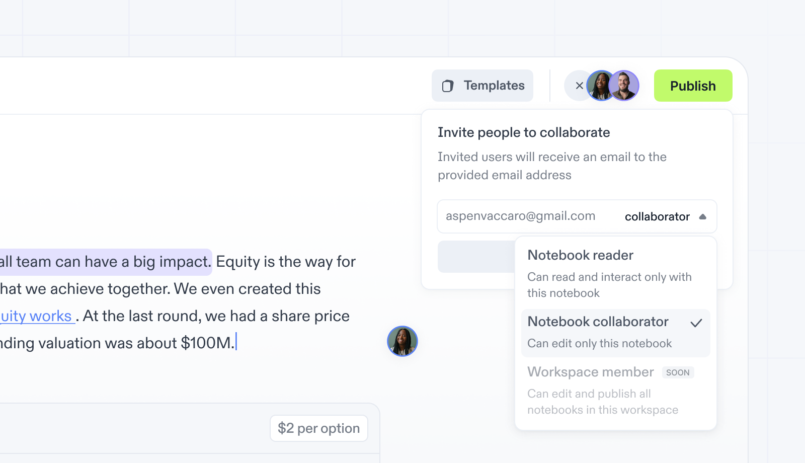

# Notebook Guests

## Share Your Notebook

1. Open your notebook and click the `Share` button on the top bar and select `Collaborate`.
3. Enter the email address and role of the person you want to invite.
2. Click `Send invite` to send an email with an invite link.

There are two roles you can assign to your teammate:

- `Collaborator`: can make changes to your notebook.
- `Reader`: has access to read your notebook and can duplicate it to make a copy.

## Change Access Permissions

1. Click the `Share` button on the top bar and select `Collaborate`.
2. Use the role dropdown next to each person's name to update the permissions.

## Remove Access to Your Notebook

1. Click the `Share` button on the top bar and select `Collaborate`.
2. Press the role dropdown next to each person's name and choose `Remove`.

**Note**: If your notebook has been published, users with the link will still be able to access your notebook as a reader.   [Learn more about publishing Notebooks →](/docs/share/publish).

## Find Notebooks Shared With You

1. Go to your workspace.
2. Select `Shared with me` on the left.
   Alternatively, you can click the link we send to your email each time someone shares a notebook with you.
